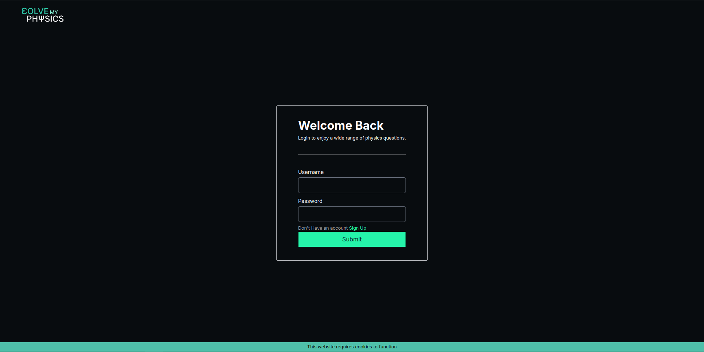
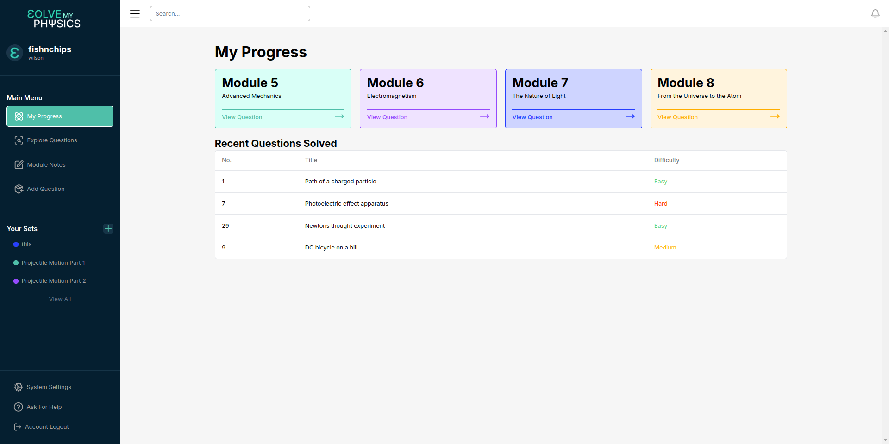
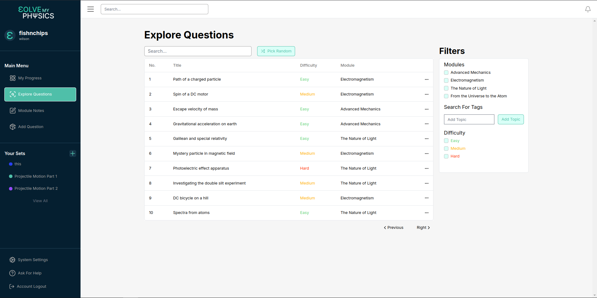
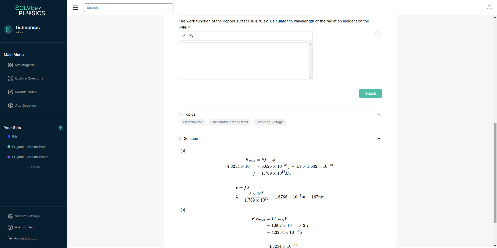
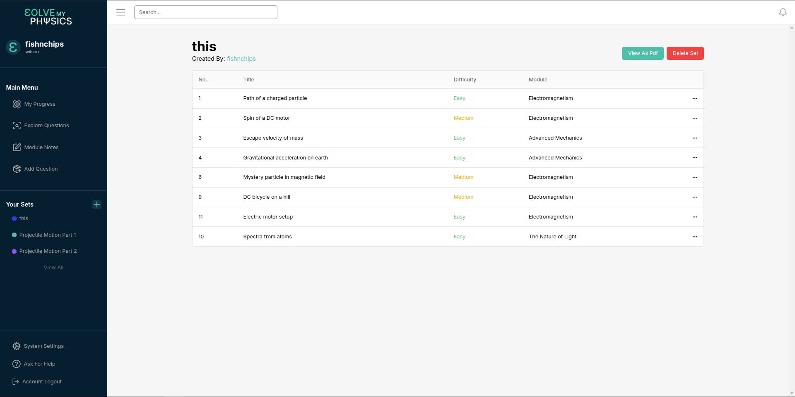
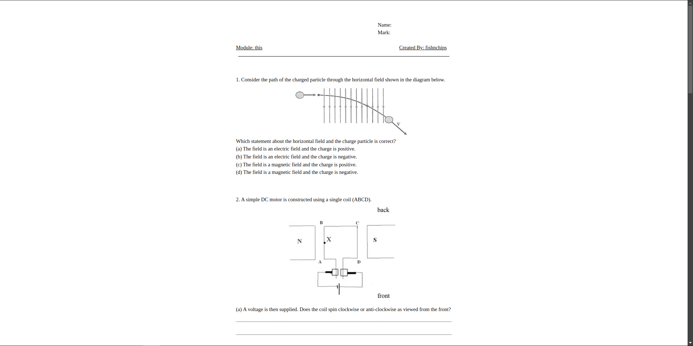

# Solve My Physics

This is an e-learning website design for HSC physics built on nextjs and spring boot.

The backend was previously deployed on AWS, however had to be removed as trial expired. Looking for new hosting platform.

## Features
- Users are initially directed to the login page on their first visit.
- They have the ability to login if they have an account or signup with an email if they don't.
- Once users have login or signed up, and they revisit the sign again they will automatically be redirected to the main page.

- Users upon logining or signing up are presented with a dashboard page where they are able to view their latest problems they solved, and keep track of their other modules.
- On the sidebar allows them to naviagte to different options including question search which presents them with the question bank and set view, which presents them with all their sets they created.
- Admin accounts have also an extra feature called the add question button, which directs the user to a page that allows them to add questions easily.

- When users click on the questions option, they are presented to the question bank where there are over 250+ questions that they can pick and choose from.
- The question bank can be searched through the bar or they can use the sidebar, which allows them to filter by module and tags.
- Questions are presented with a title, difficulty, and module, and have the ability to add the question to a set from the ellipises.

- Users can select a question from the page where they would be present with the question and either a multiple choice or a box to input their response.
- Users will also be able to see the tags on the question.
- Users will be able to see a provided solution either written by text or in latex.
- Users can submit their solution and if they are correct will be able notified

- On the sidebar users are able to create sets, which are just collections of questions.
- They are able to view all of them on the side.
- For each set users are able to remove any amount of questions they want.

- The sets are able to be viewed as a worksheet.
- This can be downloaded as a pdf file for the user.

## Demo

[Link to Demo](https://youtu.be/TkgcyrftSQ8)

## Tools

- Nextjs
- Redux
- Spring-boot
- Psql
- AWS
